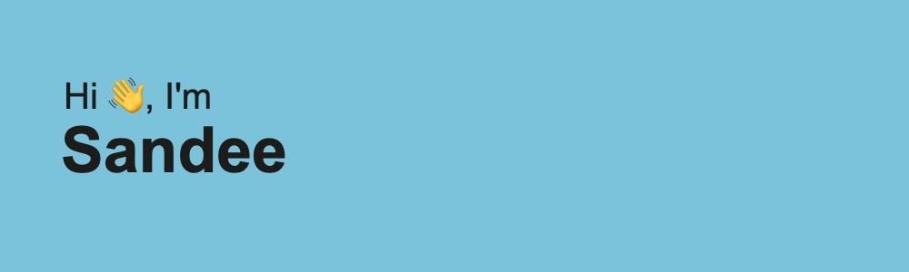

 
🌱 I’m currently pursuing Computer Engineering at Iowa State University

🔭 I’m currently working on Frontend Development

📫 How to reach me: sandee13@iastate.edu

😄 Pronouns: she/her

⚡ Fun fact: I can speak 5 languages and identify snakes!

<!--
**Sandeeptha-NotAbot/Sandeeptha-NotAbot** is a ✨ _special_ ✨ repository because its `README.md` (this file) appears on your GitHub profile.

Here are some ideas to get you started:

- 🔭 I’m currently working on ...
- 🌱 I’m currently learning Assembly level programming and web development
- 👯 I’m looking to collaborate on ...
- 🤔 I’m looking for help with ...
- 💬 Ask me about ...
- 📫 How to reach me: sandee13@iastate.edu
- 😄 Pronouns: she/her
- ⚡ Fun fact: I can speak 5 languages!
-->
